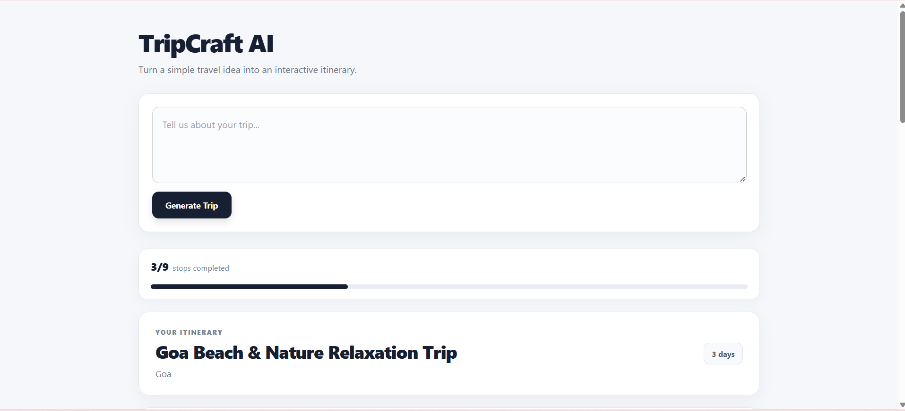
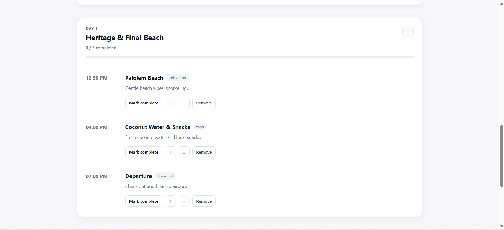
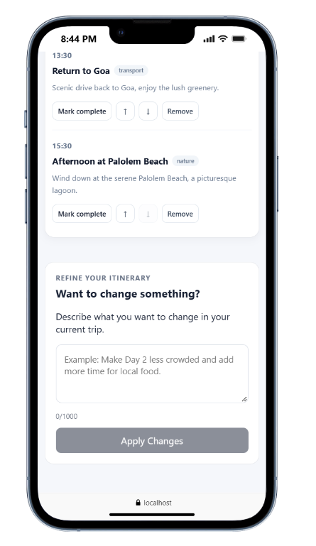

## AI-Assisted Development

AI coding assistants were used as part of the development process for TripCraft AI.

I used AI tools such as ChatGPT and GitHub Copilot in Vscode to:

- Explore and discuss the application architecture and implementation approach.
- Get guidance while building the React frontend and FastAPI backend.
- Debug errors and understand unexpected runtime and API behavior.
- Improve error handling, validation, and frontend state-management logic.
- Review and refine UI components and CSS.
- Help write and improve project documentation.

The AI tools were used as development assistants, not as a replacement for understanding or testing the implementation. I reviewed, modified, integrated, and tested the generated suggestions within the project.

The application, architecture, integration, and final implementation were developed and verified as part of this project, and I am prepared to explain and extend the code during an interview.

# TripCraft AI

> An AI-powered travel itinerary planner that converts a user's natural-language travel request into a structured, interactive and customizable day-by-day itinerary.

---

## Project Overview

TripCraft AI is a full-stack AI-powered travel itinerary application.

Instead of manually searching for destinations, activities, food spots and planning the schedule, the user can simply describe their travel requirements in natural language.

For example:

> "Plan a relaxed 3-day trip to Goa with beaches, local food and sightseeing."

TripCraft AI uses an AI model to transform the request into a structured itinerary containing:

- Trip title
- Destination
- Duration
- Travel style
- Day-by-day itinerary
- Individual stops
- Time
- Duration
- Category
- Description

The generated itinerary is then displayed through an interactive frontend where users can:

- Mark stops as completed
- Reorder stops
- Remove stops
- Track daily progress
- Track overall trip progress
- Expand/collapse individual days
- Refine the itinerary using natural language
- Preserve completed-stop state during refinement
- Handle generation and refinement failures gracefully

---

## 🛠️ Running the Project

First, clone the project from the GitHub repository:

[TripCraft AI Repository](https://github.com/chinna0425/tripcraft-ai.git)

```bash
git clone https://github.com/chinna0425/tripcraft-ai.git
cd tripcraft-ai

```

# Backend

- Navigate to the backend:
- cd backend

- Create/activate the virtual environment.
- For Windows
- venv\Scripts\activate

> Install dependencies:

- pip install -r requirements.txt

- Create .env:
- GROQ_API_KEY=your_groq_api_key
- GROQ_MODEL=your_groq_model

> Start FastAPI:

- uvicorn app.main:app --reload

- Backend will be available at: http://127.0.0.1:8000

- FastAPI documentation: http://127.0.0.1:8000/docs

# Frontend

- Navigate to the frontend:
- cd frontend

- Install dependencies:
- npm install

> Start development server:

- npm run dev
- Frontend will be available at: http://localhost:5173

The frontend will be available through the Vite development URL shown in the terminal.

## API Endpoints

> Generate Trip

- POST /api/trips/generate

Example request:
{
"prompt": "Plan a relaxed 3-day trip to Goa with beaches and local food."
}

> Refine Trip

- POST /api/trips/refine

- The request contains:

Existing trip

- Refinement instruction

> Example instruction:

- Make Day 1 less crowded and remove the shopping stop.

> Example Usage

- User input
- Plan a relaxed 3-day trip to Goa with beaches,
- local food and sightseeing.

# AI output concept

- Trip:
- Relaxed 3-Day Goa Getaway

```

Day 1
├── Hotel Check-in
├── Miramar Beach
├── Beachside Lunch
└── Local Market

Day 2
├── Fort
├── Local Food
└── Sunset Point

Day 3
├── Beach
├── Shopping
└── Departure

```

- The user can then modify the itinerary interactively.
  > Example Refinement
- Initial itinerary:
- Day 2

1. Fort
2. Lunch
3. Shopping
4. Sunset Point

> User:

- Remove shopping and make Day 2 less crowded.

- The AI returns an updated itinerary.
- The frontend then restores the completion status of stops that still exist.

## Screenshots

> Laptop View

- 
- 

> Mobile View

- 
- 

# 🏗️ Project Architecture

TripCraft AI follows a full-stack architecture:

```

                    ┌─────────────────────┐
                    │       User          │
                    │                     │
                    │ Travel Prompt       │
                    └──────────┬──────────┘
                               │
                               ▼
                    ┌─────────────────────┐
                    │   React Frontend    │
                    │                     │
                    │ Prompt Box          │
                    │ Trip View           │
                    │ Day Cards           │
                    │ Stop Cards          │
                    │ Refinement Box      │
                    └──────────┬──────────┘
                               │
                         HTTP / REST API
                               │
                               ▼
                    ┌─────────────────────┐
                    │    FastAPI Backend  │
                    │                     │
                    │ Routes              │
                    │ Services            │
                    │ Schemas             │
                    │ Validation           │
                    └──────────┬──────────┘
                               │
                               ▼
                    ┌─────────────────────┐
                    │    AI Service       │
                    │                     │
                    │ Groq API            │
                    │ Structured JSON     │
                    │ Pydantic Validation │
                    └──────────┬──────────┘
                               │
                               ▼
                    ┌─────────────────────┐
                    │   Structured Trip   │
                    │        JSON         │
                    └─────────────────────┘

```

## Technology Stack

> Frontend

- React
- JavaScript
- Vite
- CSS
- Fetch API
- React Hooks
  > Backend
- Python
- FastAPI
- Pydantic
- Uvicorn
  > AI
- Groq API
- Groq Chat Completions
- Structured JSON Schema
- Pydantic validation
  > Development
- Git
- GitHub
- VS Code
- Python virtual environment

## Trip Generation API

- The main generation endpoint is:

  > POST /api/trips/generate

- The frontend sends a travel prompt.
- Example:

  > Plan a relaxed 3-day trip to Goa with beaches and local food.

- The backend:

```

Request
↓
Trip Route
↓
Trip Service
↓
AI Service
↓
Groq
↓
Structured Trip
↓
Response

```

## Refinement Architecture

- The refinement flow is:

```

Existing Trip +
User Instruction
↓
Frontend
↓
POST /api/trips/refine
↓
FastAPI
↓
Trip Service
↓
AI Service
↓
Groq
↓
Updated Trip
↓
Frontend

```

## Progress UI

- The application provides two levels of progress tracking.
  > Daily progress
- Day 1

```

2 / 5 completed
████████░░░░

- Trip progress
  5 / 15 stops completed
  ██████░░░░░░

```

- This allows users to understand both daily and overall progress.

```

```
